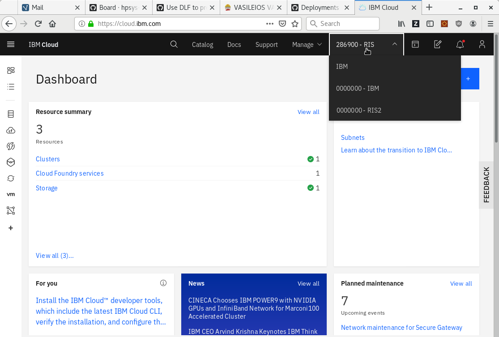
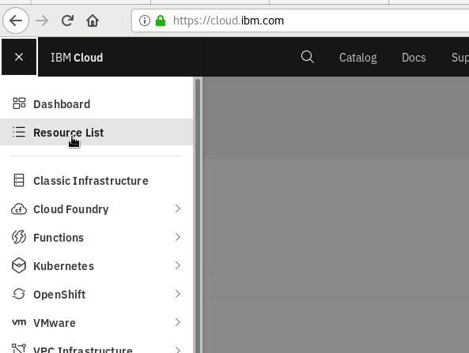
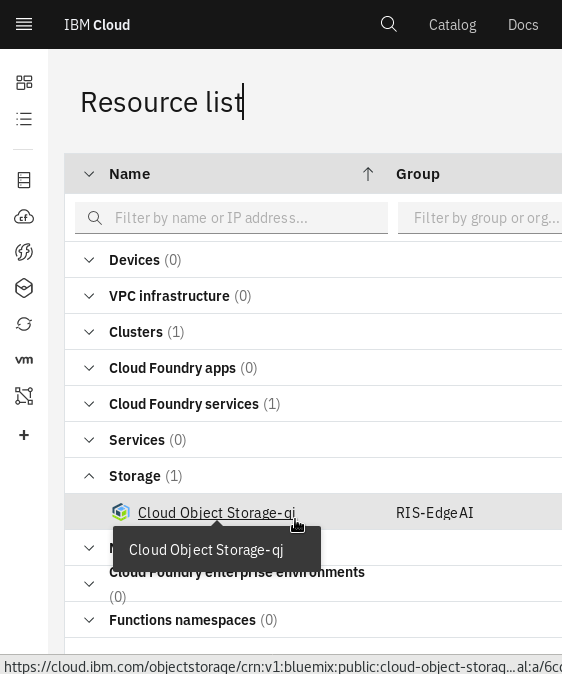
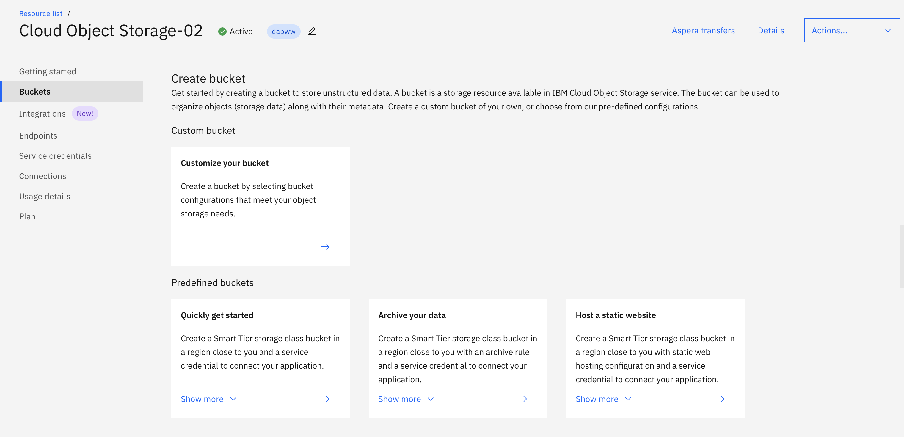
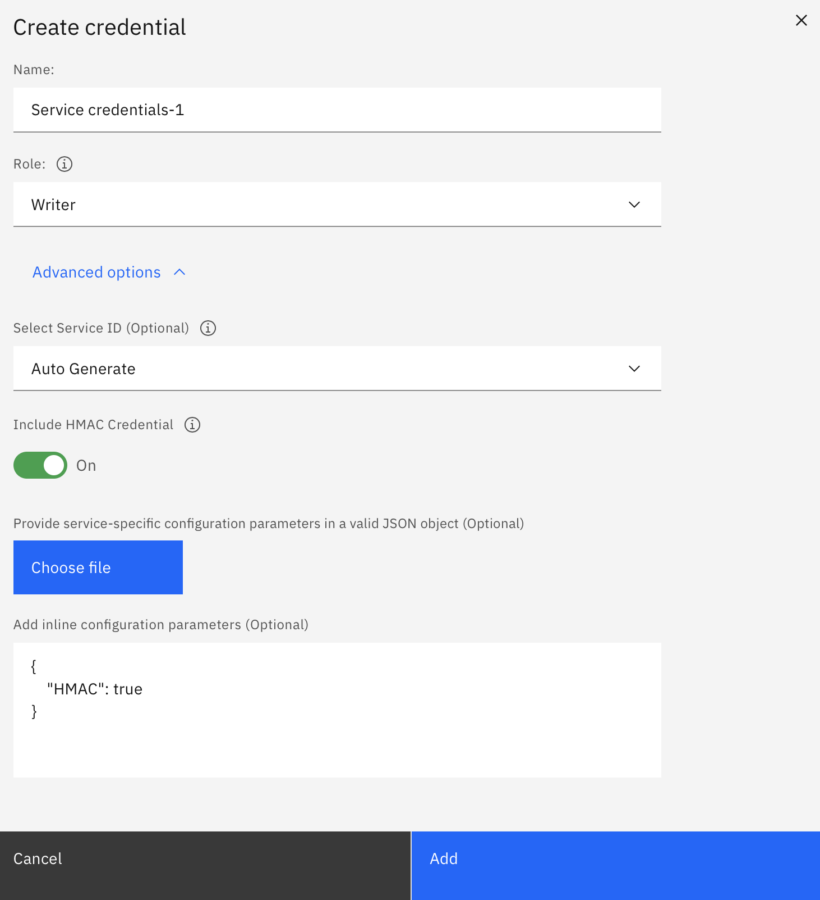
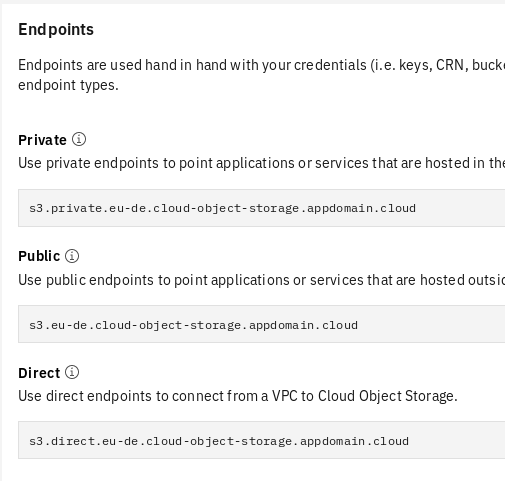

<!--

  Copyright IBM Inc. All Rights Reserved.
  SPDX-License-Identifier: Apache-2.0

-->

<PageDescription>

Use this page to learn how to create a Cloud Object Storage bucket on IBM Cloud, use it in ST4SD and accessing it on your laptop.

</PageDescription>

<AnchorLinks>
  <AnchorLink>Creating a bucket</AnchorLink>
  <AnchorLink>Getting the bucket access details</AnchorLink>
  <AnchorLink>Using the bucket with st4sd-runtime</AnchorLink>
  <AnchorLink>Accessing COS Buckets on your laptop</AnchorLink>
</AnchorLinks>

Cloud Object Store (COS) buckets are places you can store files in the cloud. This guide describes how to create a COS bucket you can use to provide data to, and get data from, workflows running on Kubernetes/OpenShift.

The advantage of this is that you can have the bucket appear as a folder on your local computer, allowing you to easily place input files for workflows in it. Further workflows can be configured to copy their output files to this bucket so they will appear in this folder too - even if they executed in some remote cluster.

## Creating a bucket

<AnchorLinks small>
  <AnchorLink>Login to IBM Cloud</AnchorLink>
  <AnchorLink>Create a COS bucket</AnchorLink>
</AnchorLinks>

### Login to IBM Cloud

Visit <https://cloud.ibm.com/>. There's a drop down menu at the top right corner where you can select your active account. Here we pick the option that reads `289600 - RIS`.



Click on the `Resource List` in the left hand menu:



Select `Storage` then click on the `Cloud Object Storage` service instance you want to host the bucket



If there is no `Cloud Object Storage` instance under `Storage` you will have to [create one](https://cloud.ibm.com/docs/cloud-object-storage?topic=cloud-object-storage-provision).

### Create a COS bucket

When you click on the cloud storage instance you should see a screen like the following: Click `Create bucket`


and then `Quickly get started`(click the arrow in the tile)



On the following screen (see below) enter a name for your bucket. You will use the name this name in the next steps. Also make a note of the bucket region, which is listed in the panel on the right - in this case it is `eu-de`.


Click the `Next`button, then you'll be greeted with a webpage like this:


Your bucket is now created and you can add files through this page. The next sections details easier ways to interact with the bucket as a folder on your laptop and also how to use it with the `st4sd-runtime`.

## Getting the bucket access details

<AnchorLinks small>
  <AnchorLink>Getting the S3 credentials</AnchorLink>
  <AnchorLink>Get an endpoint</AnchorLink>
</AnchorLinks>

The next step is to get the details that allow external programs to access the bucket

### Getting the S3 credentials

From the page shown in the last image click on the grey button `View bucket configuration` and then click on `Service credentials` on the left-most panel on the webpage. You will be offered a list of Service credentials to pick.

There is normally an entry `Service credentials-1`. Click on the dropdown button on its left and copy the values for the fields `cos_hmac_keys.access_key_id` and `cos_hmac_keys.secret_access_key`.

If you encounter either of the following

- There is no `hmac` entry!
- There is no `Service credentials-1`!

go to the next section, else continue to section `Get an endpoint`.

#### Creating a credential

There are a couple of reasons `Service credentials-1` is not present, for example

- Someone may have renamed it
- The first person to create a bucket did not use a `smart tier storage class bucket` and forgot to toggle the `Include HMAC Credential Option`

However, both are is easily corrected by creating a new credential

1. Click `New Credential`
2. Give it a name
3. Chose `Writer` for `role`
4. Click on `Advanced options`
5. Toggle on that `Include HMAC Credential` option



Note that, even though it is best practice to periodically rotate the service credentials you do not need to create new credentials each time you execute a virtual experiment. We suggest that each person generates their own service credentials and periodically rotates them.

### Get an endpoint

**Note**: Do not use the `endpoint` URL that you see listed in your HMAC `Service credentials` (section above). Please follow the instructions below to locate your S3 endpoint.

Click on the `Buckets` link in the left panel, find your bucket (use the search box if you like) and click on it.

Click on `Details` button in top right


A side panel will appear on the right. Click the `View configuration` button. This will bring up a page whiich has a section called `Endpoints` e.g.



The `public` endpoint is usually the easiest to go with. However, if you are using a Cloud Object Storage instance that is located in the same IBM Cloud organization we suggest using the `private` endpoint as it is faster and cheaper.

## Using the bucket with `st4sd-runtime`

<AnchorLinks small>
  <AnchorLink>S3 method</AnchorLink>
  <AnchorLink>Datashim method</AnchorLink>
</AnchorLinks>

There are two ways to use a COS bucket, directly (`s3`) and via [**Datashim**](https://datashim.io/). You can find more examples that you can use as a starting point for your notebooks in our [ST4SD example notebooks](https://github.com/st4sd/st4sd-examples/blob/main/notebooks/ST4SD%20Runtime%20API%20Example.ipynb).

Datashim simplifies access to buckets allowing one person to create a `dataset` (a label for the bucket) and others to use it without having to know the access keys or endpoint. It also means the bucket can be moved and users of the bucket don't have to worry as long as the dataset is updated.

We recommend using Datashim in the long run for managing datasets with workflows. However using Datashim requires it to be installed in the target cluster - check this with the cluster admin.

### S3 method

To use the bucket directly when submitting a workflow/virtual experiment from a notebook add the following to the submission configuration (see the [ST4SD Runtime API Example](https://github.com/st4sd/st4sd-examples/blob/main/notebooks/ST4SD%20Runtime%20API%20Example.ipynb) notebook for examples of submitting workflows)

```json

"s3": {
  "accessKeyID": "the  contents of `cos_hmac_keys.access_key_id`",
  "secretAccessKey": "the contents of  `cos_hmac_keys.secret_access_key`",
  "endpoint":  "your endpoint prefixed with https:// (e.g. https://s3.eu-de.cloud-object-storage.appdomain.cloud)",
  "bucket": "the name of your bucket here"
},

```

You can then specify files in the bucket as values to the `input` and `data` fields in the experiment configuration. For example, if you add a bucket and specify the following

```json
   "data": [{
       "filename": "get-smiles/input_smiles.csv"
   }]
```

Then this file, `input_smiles.csv`, will be retrieved from the folder `get-smiles/` in the bucket.

You may also store key outputs to `S3`. For example, [`sum-numbers`](https://github.com/st4sd/sum-numbers/) has a `TotalSum` key-output. You could use the payload below to upload that output to an S3 bucket:

```python
"s3Store":{
  "credentials": {
    "accessKeyID": "the  contents of `cos_hmac_keys.access_key_id`",
    "secretAccessKey": "the contents of  `cos_hmac_keys.secret_access_key`",
    "endpoint": "your endpoint prefixed with https:// (e.g. https://s3.eu-de.cloud-object-storage.appdomain.cloud)",
    "bucket": "my-bucket", # the name of your bucket
  },
  "bucketPath": "/run1_output/"
}
```

When sum-numbers finishes, it will store the file `out.stdout` on the bucket `my-bucket` under the path `/run1_output/out.stdout`.

### Datashim method

The Datashim method is similar to the previous except you provide the `s3` access informattion separately to creating a workflow and give it a name. You, and others, can then use this name to access the bucket instead of having to provide the keys etc.

For example if you wanted to create a dataset called `my-dataset` for a bucket, first create a dictionary containing (assuming you are in a iPython notebook)

```python
payload = {
  "access_key_id": "the  contents of `cos_hmac_keys.access_key_id`",
  "secret_access_key": "the contents of  `cos_hmac_keys.secret_access_key`",
  "endpoint": "your endpoint prefixed with https:// (e.g. https://s3.eu-de.cloud-object-storage.appdomain.cloud)",
  "bucket": "my-bucket", # the name of your bucket
}
# notice that the payload has snake-case fields (these are arguments to a python method)
```

Then execute

```python
api.api_dataset_create(dataset_name="my-dataset", **payload)
```

You can list the available datasets using

```python
r = api.api_datasets_list()
print(r)
```

When you submit the experiment you no longer need a full `s3` entry like the previous method. Instead, you use the dataset label

```json
"s3": {
  "dataset": "my-dataset"
},
```

You may also store key-ouputs of your virtual experiment on buckets for which you have created a Dataset. For example:

```python
"s3Store": {
  "datasetStoreURI": "dataset://my-dataset/run1_output"
}
```

The above snippet stores the workflow outputs into the bucket of Dataset `my-dataset` using `datasetStoreURI`. In this case it puts it into a sub-folder called `run1_output`. Notice that by using `s3Store.datasetStoreURI` you get the same behavior with specifying `s3Store.credentials` and `s3Store.bucketPath`.

#### Validate that Dataset has been successfully created

For this step you need access to the OpenShift cluster that is hosting the associated ST4SD instance.

To check if the dataset `my-dataset` was properly created, `oc login` to the cluster and use `oc project` to switch to the project that holds the ST4SD instance. Execute:

```
oc describe dataset my-dataset
```

The above should print a description of the `my-dataset` object. Focus on the end of the printout, the part that contains the `Status` of the object. After the Dataet object has been successfully created it should look similar to:

```python
...
Status:
  Caching:
    Info:    No DLF caching plugins are installed
    Status:  Disabled
  Provision:
    Status:  OK
```

It normally takes about 30 seconds for a Dataset object to finish provisioning. The status will display warning messages if there is something wrong with the configuration of your Dataset. The most common mistake is using the wrong `endpoint`, `bucket`, or `credentials`. The next section discusses addressing such problems.

#### I used wrong the bucket/credentials/endpoint to create my dataset, what do I do?

For this step you need access to the OpenShift cluster that is hosting the associated ST4SD instance.

First, `oc login` to the cluster, use `oc project` to switch to the project that holds the ST4SD instance, and then delete the `Dataset` object with the invalid configuration. Then you should wait for a few seconds until the `PersistentVolumeClaim` with the same name as your dataset is garbage collected and then create the dataset again using the correct configuration.

For example, to delete the `my-dataset` Dataset in the `st4sd-production` namespace after logging in to OpenShift on your terminal, run

```python
oc project st4sd-production
oc delete dataset my-dataset
# wait for the PersistentVolumeClaim (PVC) `my-dataset` to be deleted, run the command below every few seconds
# until it returns that there is no such object
oc get pvc my-dataset
```

At this point you can go back to your python notebook, correct the `Dataset` payload and execute the code:

```python
api.api_dataset_create(dataset_name="my-dataset", **payload)
```

## Accessing COS Buckets on your laptop

You can mount a COS bucket on your laptop so it appears as any other folder using a variety of tools. This means you can provide workflow input by copying into this folder, and also easily browse workflow output.

Here will demonstrate using `s3fs` (https://github.com/s3fs-fuse/s3fs-fuse). The general command is:

```
s3fs  $BUCKETNAME -o url=$ENDPOINT $MOUNTPOINT -o passwd_file=$PASSWORDFIILE
```

Here's a concrete example for a bucket called `cloud-object-storage-drl-cos-standard-ecx-focintegration`

```
s3fs cloud-object-storage-drl-cos-standard-ecx-focintegration -o url=https://s3.eu-de.cloud-object-storage.appdomain.cloud /Users/michaelj/git-working/st4sd-examples/mvp2bucket/ -o passwd_file=${HOME}/.passwd-s3fs
```

To create the password file do e.g.

```
echo ACCESS_KEY_ID:SECRET_ACCESS_KEY > ${HOME}/.passwd-s3fs
chmod 600 ${HOME}/.passwd-s3fs
```

Where

- `ACCESS_KEY_ID` - the contents of `cos_hmac_keys.access_key_id`
- `SECRET_ACCESS_KEY ` - the contents of `cos_hmac_keys.secret_access_key`
